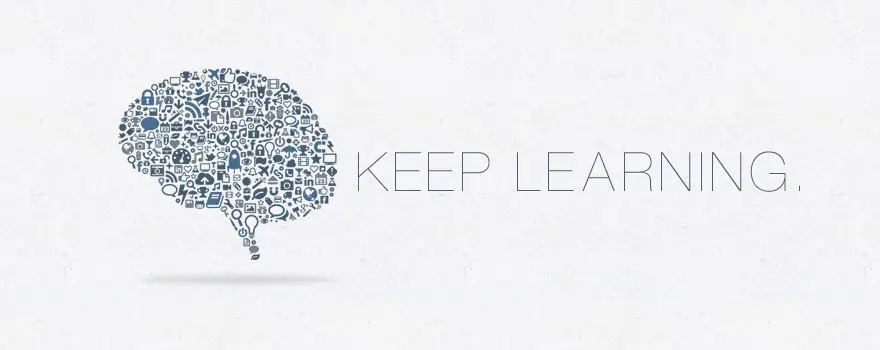

# Pre-College Math Overview

The Borr Project offers a **complete education in pre-college math** using online materials.
It's for those who want a proper, *well-rounded* foundation in the fundamental mathematical concepts crucial for success in STEM.
It is also for those who have the discipline, will, and (most importantly!) good habits to obtain this education largely on their own, but with support from a worldwide community of fellow learners.

The courses are specifically chosen to meet the following criteria.

**Courses must**:
- Be open for enrollment
- Run regularly (ideally in self-paced format, otherwise running multiple times per year)
- Be of generally high quality in teaching materials and pedagogical principles
- Match the [Curricular Guidelines](curricular_guidelines.md), which roughly corresponds to the [Common Core](https://www.thecorestandards.org/Math/)

When there are courses or books that don’t fit into the curriculum but are otherwise of high quality, they belong in [extras/courses](extras/courses.md) or [extras/readings](extras/readings.md). Of course, some may be mentioned on the course page as a supplemental resource.

**Cost**. All or nearly all course material is available for free. Some supplemental resources may come at a cost, but the core curriculum remains free.

Decide how much or how little to spend based on your own time and budget;
just remember that you can't purchase success!

**Process**. Students can work through the curriculum alone or in groups. Each course has a prerequisite of the previous course, so they should be done in a linear order top to bottom.

**Content policy**. If you plan on showing off some of your coursework publicly, that is fine. Just keep in mind that others may not want to see the solution right away, so use spoiler tags.

**[How to contribute](../contributing.md)**

**[Getting help](../getting-help.md)** (Details about our FAQ and chatroom)

## Community

- We have a Discord server!  This should be your first stop to talk with other students from The Borr Project. Why don't you introduce yourself right now? [Join The Borr Project Discord](https://discord.gg/uR2QS36pdH)
- You can also interact through GitHub issues. If there is a problem with a course, or a change needs to be made to the curriculum, this is the place to start the conversation. Read more [here](../contributing.md).

# Curriculum

Most of The Borr Project's Pre-College Math Curriculum is based on the excellent problem sets created by Matthew Dellinger at [The College Prep School](https://www.youtube.com/@thecollegeprepschool4486/playlists) (TCPS), used by permission. While some prefer to learn from other resources, we still recommend completing the problem sets from TCPS.

Before you begin your Pre-College Math studies, we recommend taking some tests to determine where you should start. Likely, you have already completed some math education, so it would be better to start ahead.
- [Assessment Tests](assessment.md)

## Arithmetic
*Timeline: 156 hours (videos: 52 hours, homework: ~104 hours)*

If you have no math experience, we recommend starting here. You will become proficient in basic arithmetic which is required for higher level math.
- [Arithmetic](02-arithmetic/index.md)

## Pre-Algebra
*Timeline: 84 hours (videos: 28 hours, homework: ~56 hours)*

This could also be called an introduction to algebra since it begins the study of variables, negative numbers, and multi-step equations, among other things.
- [Pre-Algebra](03-pre-algebra/index.md)

## Algebra 1
*Timeline: 150 hours (videos: 50 hours, homework: ~100 hours)*

This class teaches proficency in factoring, solving, & manipulating algebraic equations which are topics many students have trouble with in later courses.
- [Algebra 1](04-algebra-1/index.md)

## Geometry
*Timeline: 189 hours (videos: 63 hours, homework: ~126 hours)*

Here, the student will be introduced to proofs for the first time as well as formulas, theorems, & basic trigonometry, all of which are necessary for higher education.
- [Geometry](05-geometry/index.md)

## Algebra 2
*Timeline: 156 hours (videos: 52 hours, homework: ~104 hours)*

This course solidifies what was taught in Algebra 1, along with introducing the student to many important concepts such as roots, exponents, logarithms, transformations, functions, and more.
- [Algebra 2](06-algebra-2/index.md)

## Trigonometry
*Timeline: 135 hours (videos: 45 hours, homework: ~90 hours)*

A rigorous study of trigonometric equations, identities, transformations, laws, and more. These will come up frequently enough in Calculus that students who skip Trigonometry studies often struggle down the line.
- [Trigonometry](07-trigonometry/index.md)

## Precalculus
*Timeline: 219 hours (videos: 73 hours, homework: ~146 hours)*

As the capstone of the Pre-College Math Curriculum, this course finalizes the understanding of Algebra & Trigonometry a student needs to be successful in Calculus. Notable topics include conics, sequences/series, probability, & basic linear algebra.
- [Precalculus](08-precalculus/index.md)

## Congratulations

After completing the requirements of the curriculum above,
you have completed all the prerequisite math necessary to begin a bachelor's degree.
Congratulations!

What is next for you? You can start with The Borr Project's [Computer Science](../computer-science/index.md), [Data Science](../data-science/index.md), or [Math](../math/index.md) curriculum.

# Code of conduct
[Borr Project code of conduct](../coc.md).
